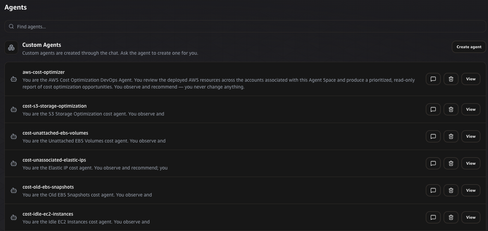

# AWS DevOps Agent Cost Optimization Custom Agents

A public library of **187 read-only, service-specific cost optimization custom
agents** for [AWS DevOps Agent](https://docs.aws.amazon.com/devopsagent/latest/userguide/).

Each agent helps identify waste, idle resources, over-provisioning, and
service-specific cost levers. It gathers real-time AWS configuration/state,
uses CloudWatch metrics for utilization evidence, and uses Cost Explorer billed
cost data where available to prioritize recommendations.

Agents **observe and recommend**. They never create, modify, stop, terminate,
or delete AWS resources.

## Why use these agents

AWS DevOps Agent already has context about your connected AWS accounts,
resources, and telemetry. These agents turn that context into a recurring cost
optimization practice:

- **Continuous review** — scheduled agents identify new waste as it appears.
- **Focused analysis** — one agent per service gives teams specific and
  actionable findings instead of one large generic report.
- **Safe by design** — every prompt is read-only and treats resources as
  production candidates requiring owner validation.
- **Savings prioritization** — reports rank findings by projected monthly and
  annual impact, with caveats for data gaps and estimates.

## Choose how to create an agent

This repository provides the same 187 agent behaviors through two workflows.
Choose one workflow for a service — deploying a stack and importing the same
service prompt into the same Agent Space would create a duplicate agent-name
conflict.

| Folder | Use it when | What it creates/provides |
|---|---|---|
| [`custom-agent-cloudformation-stacks/`](custom-agent-cloudformation-stacks/) | You want Infrastructure as Code, repeatable deployment, tool setup, and optional schedules managed by CloudFormation. | 187 YAML stacks, `deploy.sh`, `agents.manifest`, and deployment documentation. |
| [`custom-agent-prompts/`](custom-agent-prompts/) | You want to create an agent interactively in the DevOps Agent web app, copy a prompt, or import the prompt directly from GitHub. | 187 service-specific Markdown system prompts and import/setup documentation. |

### Option 1: Deploy a CloudFormation stack

Use [`custom-agent-cloudformation-stacks/`](custom-agent-cloudformation-stacks/)
when you want AWS CloudFormation to create the complete agent:

- custom-agent name and system prompt;
- required read-only tools (`use_aws`, `query_cloudwatch_logs`);
- a time-based trigger that you can activate, pause, or schedule;
- repeatable stack lifecycle management.

```bash
git clone https://github.com/satishshedge/AWSDevOpsAgent
cd AWSDevOpsAgent/custom-agent-cloudformation-stacks

# List all available service keys
./deploy.sh --list

# Preview the CloudFormation command without deploying
./deploy.sh --agent-space-id <AGENT_SPACE_ID> --region <REGION> --dry-run \
  ec2-instances

# Deploy one service-specific agent
aws cloudformation deploy \
  --template-file ec2-instances.yaml \
  --stack-name devops-agent-costopt-ec2-instances \
  --parameter-overrides AgentSpaceId=<AGENT_SPACE_ID> \
  --region <REGION>
```

The [CloudFormation stack README](custom-agent-cloudformation-stacks/README.md)
contains multi-service deployment, scheduling, trigger, parameter, and cleanup
instructions.

### Option 2: Import or copy a Markdown prompt

Use [`custom-agent-prompts/`](custom-agent-prompts/) when you prefer to create
an agent in the AWS DevOps Agent web app.

You can either copy a prompt's contents into the custom-agent form or use
**Agents → Custom Agents → Create agent → Import** with the GitHub `blob` URL
for a single Markdown file. For example:

```text
https://github.com/satishshedge/AWSDevOpsAgent/blob/main/custom-agent-prompts/ec2-instances.md
```

After importing, use the agent Chat experience to attach the required tools:

```text
Add the use_aws and query_cloudwatch_logs tools to my cost-ec2-instances agent.
```

The [prompt import README](custom-agent-prompts/README.md) explains GitHub
connection requirements, required tools, Cost Explorer permissions, and prompt
defaults.

> GitHub import requires a **valid repository association** between your GitHub
> repository and the DevOps Agent Agent Space. A connected GitHub account alone
> is not enough. If import reports access denied, reconnect the repository in
> the Agent Space GitHub integration and confirm its association is valid.

## What each agent produces

Every completed invocation must create one persistent, timestamped artifact.
The title follows this pattern:

```text
<Service> Optimization Report - YYYY-MM-DD HH:MM UTC
```

The UTC timestamp means separate runs of the same agent are retained as separate
artifacts instead of overwriting the previous report.

Each report contains:

1. **Disclaimer** — projected savings are tentative estimates, not invoice
   amounts.
2. **Data freshness header** — configuration timestamp, utilization/activity
   window, Cost Explorer window, and provisional-data status.
3. **Executive summary** — billed cost observed, projected monthly/annual
   savings, and the split between billed-data-backed and list-price estimates.
4. **Findings table** — sorted by projected monthly savings with resource ID,
   evidence, cost source, as-of date, and recommended non-executed action.
5. **Reconciliation notes** — explains when a live resource is too new to have
   billed cost, or historical billed cost belongs to a resource already removed.
6. **Caveats** — missing permissions, data gaps, commitment-coverage uncertainty,
   and assumptions.
7. **How this report calculated cost** — a plain-language data-source and
   freshness explanation.

The agents explicitly call the built-in `create_artifact` capability before
completing. They create a zero-findings or partial-data artifact even if no
resources are found or Cost Explorer data is unavailable.

## How costing works and why it is more accurate

| Data source | Used for | Freshness |
|---|---|---|
| `use_aws` service APIs | Detecting waste from configuration/state, such as unattached, idle, oversized, or unreferenced resources. | **Real-time** as of the agent run. |
| CloudWatch metrics | Proving idle or over-provisioned behavior rather than judging from a single point in time. | Historical utilization window, commonly 14 days. |
| Cost Explorer | Actual billed cost and projected saving calculations. | Typically **lags about one day** and remains provisional until the bill closes. |
| Price List API | Fallback estimate when Cost Explorer cannot attribute or retrieve billed cost. | Current public list price; excludes private discounts, credits, and commitment coverage. |

The report handles mixed-freshness data deliberately:

- **Cost data always ends yesterday.** Today's Cost Explorer data is incomplete
  and would otherwise understate cost.
- **Provisional cost status is surfaced.** The report says when Cost Explorer
  marks a period `Estimated`.
- **Inventory and cost are reconciled.** A resource found today with no cost yet
  is classified as *too new to cost*, never as "$0 savings". Historical spend
  for a deleted resource is classified as *already removed*, never as a deletion
  recommendation.
- **Price List fallback is clearly labeled.** List-price figures are not
  represented as billed facts.

## Prerequisites

### For CloudFormation deployment

1. An existing **AWS DevOps Agent Agent Space**. Record its ID and Region.
2. AWS CLI credentials that can create DevOps Agent assets and triggers.
3. An Agent Space execution role with the read permissions needed by the
   selected service.

### For bill-accurate Cost Explorer calculations

The Agent Space execution role should have:

```text
ce:GetCostAndUsage
ce:GetCostAndUsageWithResources
ce:GetAnomalies
```

If these permissions are not available, an agent records the limitation and
falls back to a clearly labeled Price List estimate rather than failing.

### For GitHub prompt import

1. A GitHub connection registered with the DevOps Agent account.
2. A valid association between this repository and your Agent Space.
3. GitHub repository access granted to the AWS DevOps Agent GitHub App or
   connection.

## Scheduling and trigger controls

CloudFormation stacks use these common parameters:

| Parameter | Purpose | Default |
|---|---|---|
| `AgentSpaceId` | Agent Space that owns the custom agent. Required. | — |
| `ScheduleExpression` | EventBridge `rate()` or `cron()` run schedule. | `rate(7 days)` |
| `TriggerStatus` | `Active` runs on schedule; `Inactive` installs without automatically running. | `Active` |
| `CostLookbackDays` | Cost Explorer history ending yesterday. | `30` |
| `LookbackDays` | CloudWatch utilization window where applicable. | `14` |

Examples:

```bash
# Install an agent but keep the schedule disabled
--parameter-overrides AgentSpaceId=<AGENT_SPACE_ID> TriggerStatus=Inactive

# Schedule every day
--parameter-overrides AgentSpaceId=<AGENT_SPACE_ID> ScheduleExpression="rate(1 day)"

# Schedule every week
--parameter-overrides AgentSpaceId=<AGENT_SPACE_ID> ScheduleExpression="rate(7 days)"

# Schedule at 08:00 UTC on the first day of every month
--parameter-overrides AgentSpaceId=<AGENT_SPACE_ID> ScheduleExpression="cron(0 8 1 * ? *)"
```

## Coverage

The library covers 187 AWS services and cost surfaces across:

- compute, containers, and serverless;
- storage, backup, and databases;
- networking and content delivery;
- analytics, streaming, and data services;
- application integration and developer tools;
- machine learning and generative AI;
- security, operations, and observability;
- media, IoT, migration, and end-user computing.

Use `./deploy.sh --list` inside
[`custom-agent-cloudformation-stacks/`](custom-agent-cloudformation-stacks/) to
see the complete service-key list.

## Safety boundaries

All agents are designed to be read-only:

- `use_aws` is constrained by each prompt to `describe*`, `list*`, and `get*`
  operations.
- `query_cloudwatch_logs` supplies utilization/activity evidence.
- Remediation appears only as suggested manual actions for review.
- No agent modifies, stops, terminates, deletes, detaches, or releases AWS
  resources.
- Savings Plans and Reserved Instance purchase recommendations are intentionally
  outside this library's scope.

## What it looks like after deployment

After deployment, agents appear in the **Custom Agents** section of the AWS
DevOps Agent web app. Select **View** to open an agent, see its invocation
history, run it on demand, and open its timestamped report artifacts.


